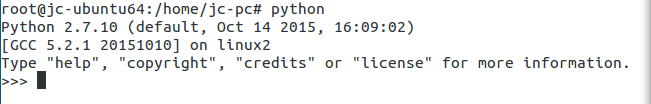

#Python Learning

---
##Ubuntu安装python
 1 . 在linux命令行窗口输入命令:
`$: wget https://www.python.org/ftp/python/3.5.2/Python-3.5.2.tgz`
等待软件下载完成,python的安装包就直接下载到当前的目录下面,文件名字为:
**Python-3.5.2.tgz**

 2 . 将下载完成的文件移动到linux的目录**/usr/local/python**下面,在**/usr/local**下面没有**python**这个文件夹,需要自己事先创建好,再将下载的文件移动到这里;
 `$: mv Python-3.5.2 /usr/local/python`

 3 . 开始解压文件夹:
 `$: tar -zxvf Python-3.5.2.tgz`

 4 . 进入解压之后的文件夹,运行**make**命令:
 `$: cd Python-3.5.2`
 `$: make` 等待一段时间之后,重新进入命令输入模式
 `$: make install` 等待命令跑完,就安装完成了,可以输入命令`$: python`,判断是否已经安装成功,如果成功的话,则显示python的基础信息:

 

 安装就此完成,可以尽情地玩耍了;

 ---

 ---

 ---

