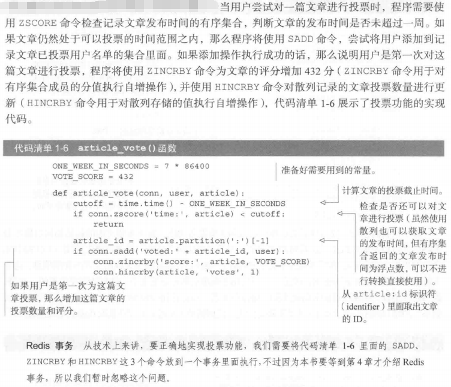
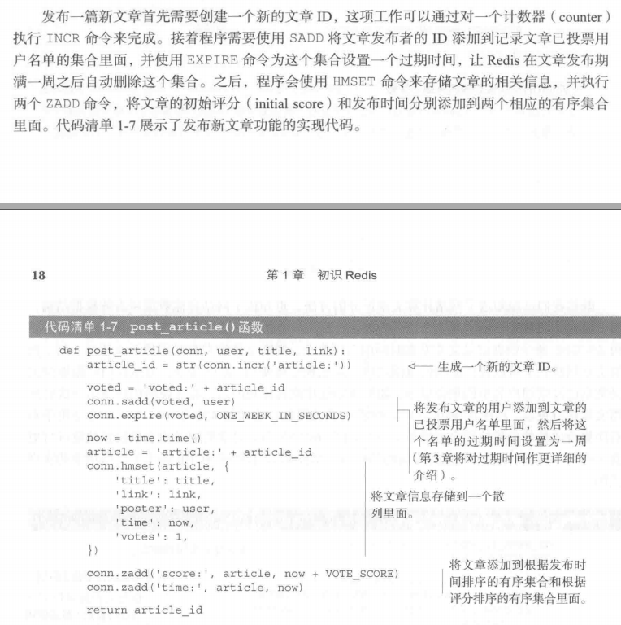
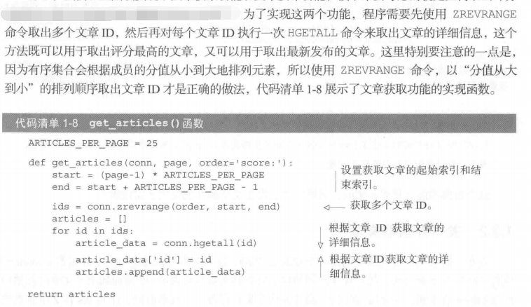

# charpter 1 introduction redis

## redis简介:
Redis是一个速度非常快的非关系数据库,它

 * 可以存储键(key)与5种不同类型的值(value)之间的映射(mapping);

 * 可以将存储在内存中的键值对数据持久化到硬盘中;

 * 可以使用复制特性来扩展读性能;

 * 可以使用客户端分片扩展写性能;

---

 * redis可以用来作为主存储(primary storage)和二级存储(secondary storage),目前还不知道主存储和二级存储的具体概念,后面的章节会给出这方面的介绍;

---

## redis的5中数据结构

* STRING(字符串)

* LIST(列表)

* SET(集合)
	
	* 集合元素是无序的;

* HASH(散列)

* ZSET(有序集合)

	* 集合的键被称为成员(member),集合的值被成为分值(score),分值必须是浮点数;

	* 有序集合是Redis里面唯一一个既可以根据成员访问元素,又可以根据分值以及分值的排列顺序来访问元素的结构.

---

## 实例:对文章进行投票

问题叙述:

要构建一个文章投票网站,投票的结果是,当投票的数量**>=200**张的时候,该文章会在文章列表置顶显示至少一天;

#### 限制条件:

* 使用UTC时间,通过一系列计算得到投票分数,计算公式为:支持的票数乘以一个常量,加上文章的发布时间(UTC时间)

* 常量为:一天的秒数(86400)除以文章的置顶限制选票(200),得到的数据是432;也就是文章每次获得一张选票就会添加432分

* 必须是一周内的文章才可以投票

* 用户只能投一次票

* 可以根据时间排序,也可以根据评分排序

具体的思路流程和python代码:

---

## 发布文章

具体思路可以查看图片中的介绍:

---

## 获取文章

需求是,获取评分最高的文章以及获取最新发布的文章;具体思路和算法请查看图片中的介绍:

---

