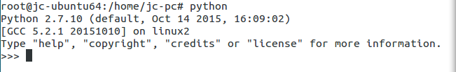

#INSTALL SOFTWARE

---
## Ubuntu安装python
 1. 在linux命令行窗口输入命令:
`$: wget https://www.python.org/ftp/python/3.5.2/Python-3.5.2.tgz`
等待软件下载完成,python的安装包就直接下载到当前的目录下面,文件名字为:
**Python-3.5.2.tgz**

 2. 将下载完成的文件移动到linux的目录**/usr/local/python**下面,在**/usr/local**下面没有**python**这个文件夹,需要自己事先创建好,再将下载的文件移动到这里;
 `$: mv Python-3.5.2 /usr/local/python`

 3. 开始解压文件夹:
 `$: tar -zxvf Python-3.5.2.tgz`

 4. 进入解压之后的文件夹,运行命令:
 `$: cd Python-3.5.2`
 `$: ./configure`
 `$: make` 等待一段时间之后,重新进入命令输入模式
 `$: make install` 等待命令跑完,就安装完成了,可以输入命令`$: python`,判断是否已经安装成功,如果成功的话,则显示python的基础信息:

 

 安装就此完成,可以尽情地玩耍了;

 ---

 ---

 ---

## Ubuntu安装redis
 1. 进入linux目录**/usr/local**创建目录**redis**,进入该目录
 `$: cd /usr/local`
 `$: mkdir redis`
 `$: cd redis`
 `$: wget http://download.redis.io/releases/redis-2.6.14.tar.gz`等待命令跑完,就下载好文件**redis-2.6.14.tar.gz**

 2. 解压文件**redis-2.6.14.tar.gz**,
 `$: tar -zxvf redis-2.6.14.tar.gz`进入解压之后的文件,直接输入命令
 `$: make`,编译文件

 3. 进入**src**目录,输入命令
 `$: make install`

 4. 返回到安装目录,这里是**redis-2.6.14**,输入命令
 `$: redis-server redis.conf`
 redis就安装成功,并且启动了;

 ---

 ---

 ---

## 为python语言安装redis客户端库*hiredis*
**介绍:**hiredis作为python适合的库,用来连接和访问redis客户端;
 
 1. 创建目录*/usr/local/ez_python*
 `$: mkdir /usr/local/ez_python`

 2. 下载python工具包
 `$: wget http://peak.telecommunity.com/dist/ez_setup.py`

 3. 运行下载的python文件
 `$: python ez_setup.py`

 4. 下载安装python的redis库--->hiredis
 `$: python -m easy_install redis hiredis`

 等待数据跑完就安装完成了;

 ---

 ---

 ---

## 可能出现的问题:

 1. 在运行命令`python -m easy_install redis hiredis`的时候直接报错,错误内容为
 > error: command 'x86_64-linux-gnu-gcc' failed with exit status 1

 通过谷歌之后发现了解决方法,这里可以直接查看问题的回答内容:[点击进入](http://stackoverflow.com/questions/26053982/error-setup-script-exited-with-error-command-x86-64-linux-gnu-gcc-failed-wit);说明的内容是这样子的:
 > Python.h is nothing but a header file. It is used by gcc to build applications. You need to install a package called python-dev. This package includes header files, a static library and development tools for building Python modules, extending the Python interpreter or embedding Python in applications.

 解决方法:
 `$: sudo apt-get install python-dev`
 等待程序跑完就可以继续运行刚刚报错的命令了;

---

 2. 为什么不推荐在windows环境中使用redis?
 